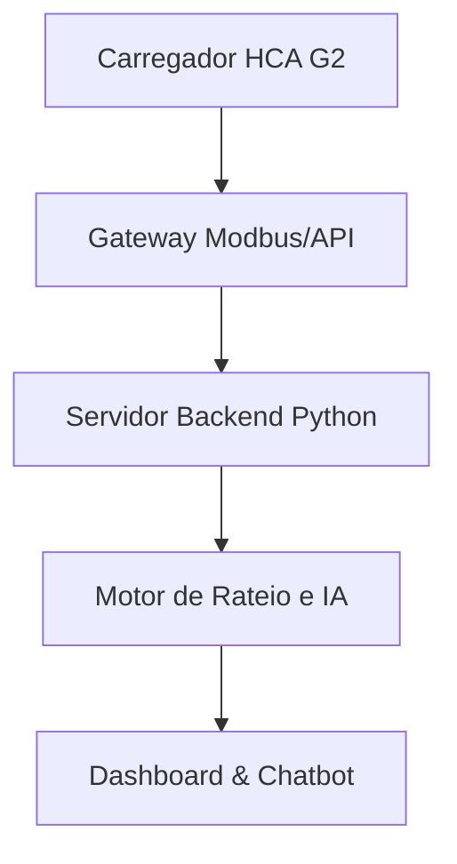

# ⚡ EV ChargeOps — Gestão Inteligente de Recarga Coletiva

> **Monitoramento • Rateio Automatizado • Previsão de Demanda • Inteligência Operacional**


---

## 🌌 Visão Geral
O **EV ChargeOps** é um sistema de gestão operacional desenvolvido para o **Enterprise Challenge 2026 (GoodWe + FIAP)**. Nosso objetivo é transformar sessões de recarga de VEs em dados estruturados e inteligência acionável para condomínios, resolvendo problemas de rateio, sobrecarga de rede e experiência do usuário.

### O que o sistema entrega:
* 🔌 Monitoramento em tempo real via API GoodWe e Modbus TCP.
* 🧾 Rateio automático de custos por unidade consumidora.
* ⚡ Gestão dinâmica de carga (Load Balancing).
* 🧠 Previsão de demanda energética com IA.
* 💬 Chatbot (NLP) para consulta de faturamento e status.
* 🚨 Alertas inteligentes de falha.

---

## 📊 Arquitetura de Dados
O sistema coleta dados de telemetria diretamente do carregador **GoodWe HCA G2**.

| Dado | Fonte | Função |
| :--- | :--- | :--- |
| `power` | API/Modbus | Potência instantânea da recarga |
| `energy` | API/Modbus | Volume total de energia entregue (kWh)|
| `status` | API | Estado da sessão (idle, charging, fault)|
| `soc` | BMS/Inversor | Nível de carga (quando aplicável) |

---

## 🚀 Proposta de Valor
**O síndico ganha:** Transparência no rateio, segurança operacional da rede e relatórios automáticos.
**O morador ganha:** Autonomia via App, histórico de consumo e tarifação justa (Pay-per-use).

---

## ⚙️ Fluxo Lógico do Sistema


## 📁 Estrutura do Projeto

```text
EVChargeOps/
├── data/
│   └── rateio_mensal.json
├── docs/
│   ├── arquitetura.png
│   └── EV ChargeOps.pdf
├── src/
│   ├── integraçao_api.py
│   ├── motor_rateio.py
│   ├── predicao_ia.py
│   └── chatbot_sindico.py
├── README.md
└── requirements.txt

```

## 🤖 Inteligência Artificial

A IA atua como motor de otimização:

* Previsão de Demanda: Regressão para antecipar picos de uso e ajustar a potência das estações.
* Síndico Virtual (NLP): Agente conversacional que traduz dados brutos da API em informações gerenciais.

## 🚨 Gestão de Falhas e SRE

Seguindo princípios de SRE, o sistema prioriza:

* Consistência: Logs de sessão persistidos localmente em caso de queda de internet.
* Disponibilidade: Monitoramento proativo via códigos de erro (AC Fault Bytes).
* Escalabilidade: Arquitetura desacoplada para adição de múltiplos carregadores.

## 👥 Equipe

| Integrante       | RM        | Email                           |
| ---------------- | --------- | -----------------------------   |
| Vinicius Pelogia | RM572675    | vinipelogia@gmail.com         |
| David Tomaz      | RM570348    | daviddesatomaz@gmail.com      |
| Eric Yuiti       | RM573495    | Eric.nissi@gmail.com          |
| Antuny Menezes   | RM572107    | antunyyt@gmail.com            |

## 🔗 Referências

* Resolução Normativa ANEEL nº 1.000/2021.
* GOODWE. Manual do Usuário: Carregador CA Série HCA G2.
* GOODWE. Protocolo Modbus HCA G2.
* FIAP. Enterprise Challenge 2026 — GoodWe + FIAP.
